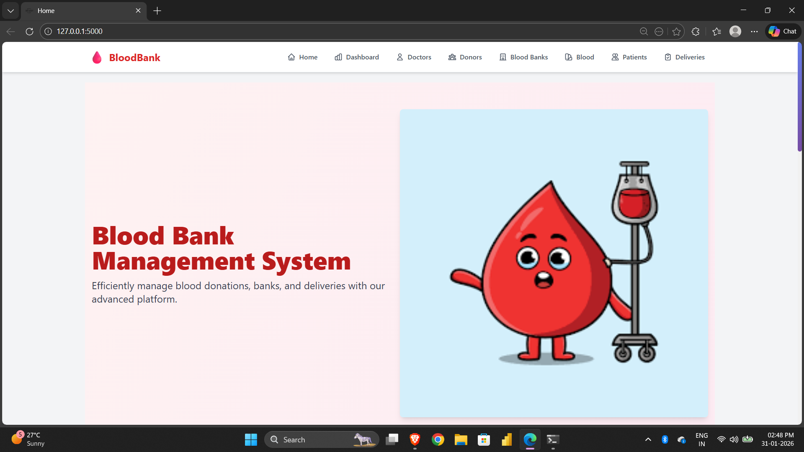
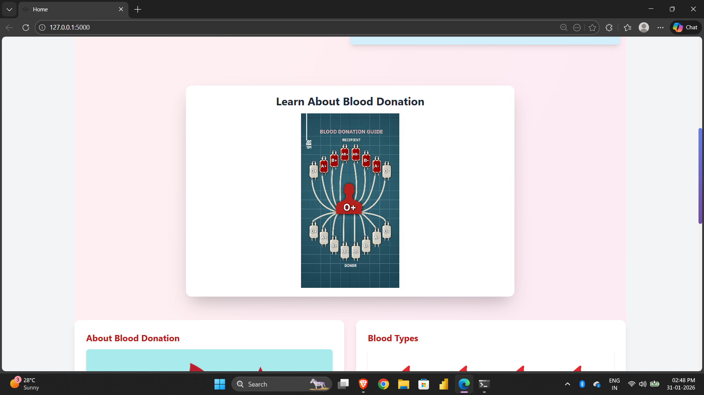
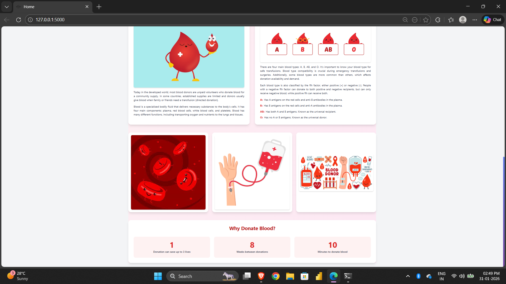
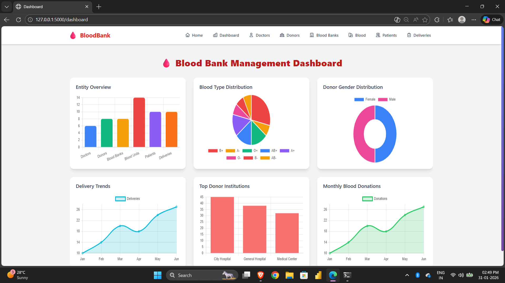
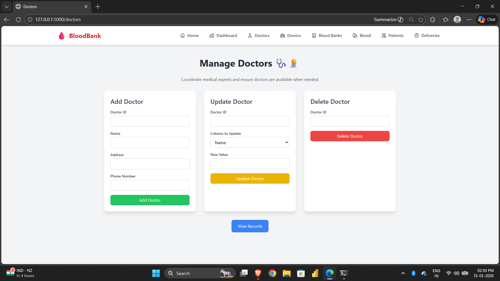
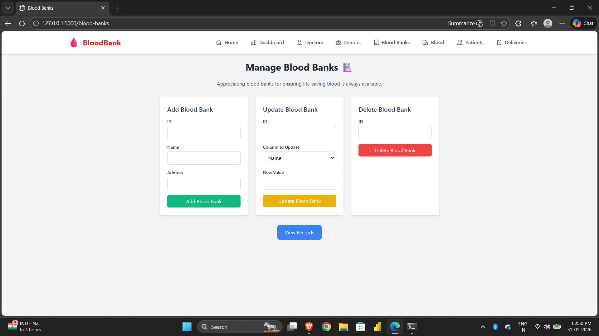
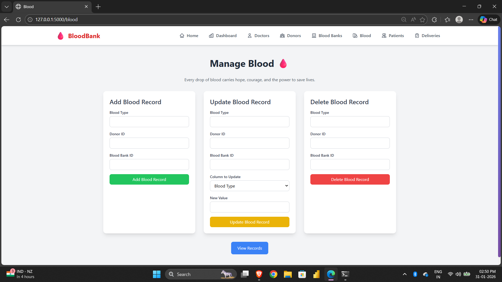

# 🩸 Blood Bank Management System

A modern, full-featured web application for managing blood banks, donors, patients, and blood deliveries. Built with Flask, MySQL, and modern UI frameworks.

   
  Architecture

---

## 🌟 Features

### Core Functionality
- **👨‍⚕️ Doctor Management**: Add, update, delete, and view doctor records
- **❤️ Donor Management**: Track blood donors with detailed information (blood type, weight, BP, etc.)
- **🏥 Blood Bank Management**: Manage multiple blood bank locations
- **🩸 Blood Inventory**: Track blood units by type and donor
- **💉 Patient Management**: Maintain patient records and hospital information
- **🚚 Blood Delivery Tracking**: Monitor blood deliveries from banks to patients

### Advanced Features
- **📊 Interactive Dashboard**: Real-time statistics with Chart.js visualizations
  - Total counts for doctors, donors, blood banks, patients, and deliveries
  - Blood type distribution (pie chart)
  - Gender distribution (doughnut chart)
  - Top institutions (bar chart)
- **📹 Educational Content**: Embedded video about blood donation
- **🎨 Beautiful Landing Page**: Informative home page with blood donation facts

---

## 🛠️ Technology Stack

### Backend
- **Flask** - Python web framework
- **MySQL** - Database management
- **PyMySQL** - MySQL connector for Python

### Frontend
- **Tailwind CSS** - Utility-first CSS framework
- **Chart.js** - Interactive charts and graphs
- **DataTables** - Advanced table features
- **jQuery** - JavaScript library

## 📊 Database Schema

### Tables
1. **Doctor** - Medical professionals
2. **Donor** - Blood donors with health info
3. **Blood_bank** - Blood bank locations
4. **Blood** - Blood inventory records
5. **Patient** - Patient information
6. **Blood_delivery** - Delivery tracking

See `schema.sql` for complete structure.

---

## Screenshots
### Home 

  
  
  

### Dashboard

### Doctor, Blood Bank, Blood etc 

  
  
  

